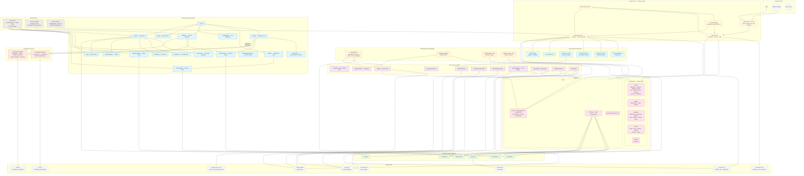

```mermaid
graph TB
  classDef page fill:#e1f5fe,stroke:#0288d1
  classDef widget fill:#fff3e0,stroke:#ff9800
  classDef api fill:#f3e5f5,stroke:#9c27b0
  classDef sse fill:#e8f5e9,stroke:#4caf50
  classDef db fill:#fce4ec,stroke:#e91e63
  classDef external fill:#f5f5f5,stroke:#9e9e9e,stroke-dasharray:3
  classDef infra fill:#fff8e1,stroke:#ffc107
  classDef backend fill:#e0f7fa,stroke:#00bcd4
  classDef auth fill:#efebe9,stroke:#795548
  classDef payment fill:#fbe9e7,stroke:#ff5722

  subgraph External["External World"]
    direction LR
    User(("User")):::external
    Streamer(("Streamer (OBS)")):::external
    DiscordUser(("Discord User")):::external
  end

  subgraph Infra["Infrastructure — Docker Swarm"]
    Nginx["Nginx Reverse Proxy<br/>(SSE: buffering off, 200s timeout)"]:::infra
    GiteaCI["Gitea Actions CI/CD"]:::infra
    Registry["Private Registry<br/>registry.neko-piranha.ts.net"]:::infra
    AppService["App Service<br/>2 replicas · 1 CPU / 1 GB"]:::infra
    BackendService["Backend Service<br/>1 replica · 1 CPU / 512 MB"]:::infra
  end

  subgraph Pages["Frontend Pages (app/(ui)/)"]
    direction TB
    Home["/ Home"]:::page
    Donate["/donate — Donation Form"]:::page
    DonateTop["/donate/top — Leaderboard + Podium"]:::page
    DonateAdmin["/donate/admin — Donation Admin"]:::page
    Artifact["/artifact — Submission Form"]:::page
    ArtifactAdmin["/artifact/admin — Review Panel"]:::page
    Rubgram["/rubgram — Service Ordering"]:::page
    RubgramAdmin["/rubgram/admin — Admin Panel"]:::page
    RubgramSlip["/rubgram/admin/slip — Archive Viewer"]:::page
    Tierlist["/tl/[type]/[ver] — Tier Rankings"]:::page
    Guide["/guide — Build Guides"]:::page
    AdminDash["/admin — Dashboard"]:::page
    AdminChar["/admin/char — Character Manager"]:::page
    AdminCDN["/admin/cdn — File Manager"]:::page
    AdminLog["/admin/log — Audit Log"]:::page
    AdminSettings["/admin/settings — Config"]:::page
    Login["/login — Admin Login"]:::page
  end

  subgraph Widgets["OBS Widgets (app/widget/)"]
    DonateWidget["/widget/donate<br/>Donation Alert Popup<br/>SFX + TTS + Animation"]:::widget
    DonateTopWidget["/widget/donate/top<br/>Top Donor Bar"]:::widget
    ArtifactCountWidget["/widget/artifact-count<br/>Queue Counter"]:::widget
    RubgramCountWidget["/widget/rubgram-count<br/>Queue Counter"]:::widget
  end

  subgraph APIs["API Routes (app/api/)"]
    APIAuth["/api/auth/[...all] — better-auth"]:::api
    APITTS["/api/tts — Gemini TTS"]:::api
    APIDonateHB["/api/donate/hb — Heartbeat"]:::api
    APIRubgramCount["/api/rubgram/count"]:::api
    APIAmberSync["/api/amber/sync"]:::api
    APIAmberChar["/api/amber/char (ISR)"]:::api
    APIAmberLog["/api/amber/log (ISR)"]:::api
    APICard["/api/card/[sub] — Card Render"]:::api
    APISlip["/api/slip/[id] — Slip Image"]:::api
    APIDiscord["/api/discord/users"]:::api
    APIHealth["/api/health"]:::api
  end

  subgraph SSE["Real-Time SSE (app/sse/)"]
    SSEArtifact["/sse/artifact"]:::sse
    SSERubgram["/sse/rubgram"]:::sse
    SSEDonate["/sse/donate"]:::sse
    SSEActive["/sse/active"]:::sse
    SSELog["/sse/log"]:::sse
    SSETierlist["/sse/tl.{name}"]:::sse
  end

  subgraph Backend["Backend (Bun Bytecode)"]
    direction TB
    RubgramExpiry["Expiration Check<br/>(20min timeout)"]:::backend
    RubgramArchive["Monthly Archive<br/>Incremental rounds"]:::backend
    AmberCron["Amber Sync Cron<br/>(every 14 days)"]:::backend
    CardCache["Card Cache GC"]:::backend
    DBSeed["DB Seeding<br/>(admin + defaults)"]:::backend
    DiscordWebhook["Discord Webhook<br/>Subscriber"]:::backend
  end

  subgraph DB["Database"]
    direction LR
    subgraph PG["PostgreSQL — Drizzle ORM"]
        PublicSchema("public<br/>characters · versions · settings · guides<br/>cdn · auditLog · user · session<br/>account · verification"):::db
        ArtifactSchema("artifact<br/>submissions · cards · settings"):::db
        EndgameSchema("endgame<br/>submissions · sarchive · expired<br/>slips · settings · discord · types"):::db
        TierlistSchema("tierlist<br/>types · tiers · columns · badges<br/>versions · states"):::db
        DonateSchema("donate<br/>donations"):::db
    end
    subgraph Redis["Redis"]
        RedisPubSub("Pub/Sub — SSE Broadcasting"):::db
        RedisCache("Cache — TTS Audio (7d) · Health (15m)<br/>Discord Users · Amber Hash (24h)"):::db
        RedisAuth("Auth Tokens (600s TTL)"):::db
    end
  end

  subgraph ExtAPI["External APIs"]
    AmberAPI["Project Amber<br/>gi.yatta.moe"]:::external
    EnkaAPI["Enka Network<br/>enka.network"]:::external
    AstralAPI["Astral API<br/>Card Rendering"]:::external
    SlipOKAPI["SlipOK<br/>PromptPay Verification"]:::external
    SastifyAPI["Sastify<br/>TrueMoney Redemption"]:::external
    GeminiAPI["Google Gemini TTS<br/>gemini-2.5-flash-preview-tts"]:::external
    DiscordAPI["Discord API<br/>OAuth2 · Bot · Webhooks"]:::external
    YouTubeAPI["YouTube API<br/>Live Status"]:::external
    PostHogAPI["PostHog Cloud<br/>Analytics + Error Tracking"]:::external
  end

  subgraph Auth["Authentication"]
    BetterAuth["better-auth<br/>Email/Password · Admin Role<br/>Drizzle Adapter"]:::auth
    DiscordOAuth["Discord OAuth2<br/>Rubgram Users<br/>Persisted via cookie token"]:::auth
    InternalToken["Internal Tokens<br/>Redis-backed · 600s TTL<br/>X-Internal-Auth header"]:::auth
  end

  subgraph Payments["Payment Processing"]
    SlipOKFlow["PromptPay (SlipOK)<br/>Slip image → verify → dedup by transRef<br/>Used: Rubgram + Donation"]:::payment
    TMNFlow["TrueMoney (Sastify)<br/>Voucher link → redeem API<br/>Used: Donation only"]:::payment
  end

  User --> Nginx
  Streamer --> Nginx
  Nginx --> AppService
  GiteaCI --> Registry

  GiteaCI --> AppService
  GiteaCI --> BackendService
  Registry --> AppService
  Registry --> BackendService

  Home --- Donate & Artifact & Rubgram & Tierlist & Guide & AdminDash
  Donate --- DonateTop & DonateAdmin
  Artifact --- ArtifactAdmin
  Rubgram --- RubgramAdmin & RubgramSlip
  AdminDash --- AdminChar & AdminCDN & AdminLog & AdminSettings & Login

  BetterAuth --- Login & AdminDash & DonateAdmin & ArtifactAdmin & RubgramAdmin
  DiscordOAuth --- Rubgram
  InternalToken --- BackendService

  AppService --- PG & Redis
  BackendService --- PG & Redis

  Donate --- SlipOKFlow & TMNFlow
  Rubgram --- SlipOKFlow
  SlipOKFlow --- SlipOKAPI
  TMNFlow --- SastifyAPI

  RedisPubSub --- SSEArtifact & SSERubgram & SSEDonate & SSEActive & SSELog & SSETierlist

  DonateAdmin --- SSEDonate
  ArtifactAdmin --- SSEArtifact
  RubgramAdmin --- SSERubgram
  AdminDash --- SSELog

  DonateWidget --- SSEDonate
  DonateTopWidget --- SSEDonate
  ArtifactCountWidget --- SSEArtifact
  RubgramCountWidget --- SSERubgram

  DonateWidget --- APITTS & APIDonateHB
  DonateTopWidget --- APIDonateHB

  APITTS --- GeminiAPI
  APICard --- AstralAPI & EnkaAPI
  APIAmberSync & APIAmberChar & APIAmberLog & APIHealth --- AmberAPI
  APIHealth --- EnkaAPI
  APIDiscord --- DiscordAPI
  SSEActive --- YouTubeAPI
  AppService --- PostHogAPI

  BackendService --- DiscordAPI & DiscordWebhook
  BackendService --- RubgramExpiry & RubgramArchive & CardCache & DBSeed
  AmberCron --- APIAmberSync

  APITTS --- RedisCache
  APIHealth --- RedisCache
  APIDiscord --- RedisCache

  Donate -. "skip-queue<br/>(promoted)" .-> Artifact
```
