# Buzz Events

Next.js 16 application running multiple community events for YouTuber Buzz. Built with TypeScript, Bun, PostgreSQL, and Redis.

## Branches

### Donation

Payment-processing and stream-overlay system with two payment methods:

- **TrueMoney (TMN):** Voucher gift link redemption via Sastify API
- **PromptPay (SlipOK):** Slip image upload verified by SlipOK API

Key features:

- **Real-time overlay widget** (OBS-ready): SSE-driven animated popup with donor image, name, amount, message; plays SFX + Gemini TTS audio announcement (`"<name> โดเนทมา <amount> บาท"`)
- **Top donors leaderboard** at `/donate/top` — podium (1st–3rd) + table (4th–10th)
- **Admin panel** at `/donate/admin` — view donations, re-send popups, test popup, force-reload all widgets, copy artifact UIDs, view donor images
- **Heartbeat system:** Widget health monitoring with auto-recovery after 6+ missed heartbeats
- Sub-10 THB donations skip overlay but update leaderboard
- Queue-skip for artifact submissions (promoted queue)

### Artifact

Moderator-supervised character showcase ID review system:

- **Public submission** at `/artifact` — UID + character + comment form
- **Enka Network integration:** Auto-fetches showcase characters from UID
- **Free queue:** FIFO, 1 character reviewed per submission
- **Donation skip-queue:** Promoted submissions (`queue = NULL`), up to 8 characters, visually distinct in admin (yellow border, bitcoin icon)
- **Admin panel:** Sidebar with sorted submission list (special queue first), checkmark toggle, Enka card browser (iframe + rendered card), random picker, wipe/reset
- **Queue management:** Lock toggle, configurable capacity limit (`-1` = unlimited)
- **Card generation:** External MTS service renders character cards; cached as `bytea` in DB with revalidation support
- **Widget:** `/widget/artifact-count` — OBS overlay displaying count/limit

### Rubgram (รับกรรมแทนทางบ้าน)

Paid endgame content service where Buzz plays on your account:

- **Discord OAuth2** required — auto-joins guild, session persisted via cookie token
- **Service selector:** Multiple configurable service types with real-time price estimation; "all services" discount
- **Free queue counter:** Admin-configurable free slots (price = 0)
- **20-minute payment window** with PromptPay QR code and slip upload
- **SlipOK verification** with deduplication by `transRef`
- **Expiration system:** Unpaid submissions auto-expire with queue rebalancing; expired users can restore and pay
- **Admin panel:** Lock/limit/free controls, manual submission creation, Discord ping ("ถึงคิวแล้ว"), slip archive viewer by round, monthly archive
- **Widget:** `/widget/rubgram-count` — OBS overlay displaying count/limit

### Tierlist

Community character tier rankings:

- **Multi-type, multi-version:** Browse by category (e.g. Endgame Content) and patch
- **Drag-and-drop** via dnd-kit — place characters into SS/A/B/C/D tiers within On-Field DPS / Off-Field DPS / Support columns
- **Real-time collaboration** via SSE — all connected clients sync instantly
- **Comments & badges** assignable to individual placements
- **Admin edit mode** at `/:type/:ver/admin`
- Data sourced from Project Amber

### Guide

Character build guide directory:

- Searchable grid with debounced ilike search
- Each card links to an external Google Sheet
- Admin hide/unhide controls

### Admin

Centralized management panel at `/admin` (guarded by better-auth):

- **Dashboard:** Random Nod-Krai welcome messages, health monitor (DB, Enka, Amber, Redis/SSE)
- **Character manager:** CRUD for Genshin characters (element, weapon, stars, CDN image, Amber ID)
- **CDN file manager:** Upload, rename, import from URL
- **Guide admin:** Hide/unhide guides
- **Settings:** Enka Network toggle, manual Amber sync, account (WIP)
- **Audit log:** Last 1000 admin actions with user info
- **Section shortcuts:** Links to artifact, rubgram, donate, and tierlist admin

```mermaid
graph TB
  classDef page fill:#e1f5fe,stroke:#0288d1
  classDef widget fill:#fff3e0,stroke:#ff9800
  classDef api fill:#f3e5f5,stroke:#9c27b0
  classDef sse fill:#e8f5e9,stroke:#4caf50
  classDef db fill:#fce4ec,stroke:#e91e63
  classDef external fill:#f5f5f5,stroke:#9e9e9e,stroke-dasharray:3
  classDef infra fill:#fff8e1,stroke:#ffc107
  classDef backend fill:#e0f7fa,stroke:#00bcd4
  classDef auth fill:#efebe9,stroke:#795548
  classDef payment fill:#fbe9e7,stroke:#ff5722

  subgraph External["External World"]
    direction LR
    User(("User")):::external
    Streamer(("Streamer (OBS)")):::external
    DiscordUser(("Discord User")):::external
  end

  subgraph Infra["Infrastructure — Docker Swarm"]
    Nginx["Nginx Reverse Proxy<br/>(SSE: buffering off, 200s timeout)"]:::infra
    GiteaCI["Gitea Actions CI/CD"]:::infra
    Registry["Private Registry<br/>mts.dgnr.us:5000"]:::infra
    AppService["App Service<br/>2 replicas · 1 CPU / 1 GB"]:::infra
    BackendService["Backend Service<br/>1 replica · 1 CPU / 512 MB"]:::infra
  end

  subgraph Pages["Frontend Pages (app/(ui)/)"]
    direction TB
    Home["/ Home"]:::page
    Donate["/donate — Donation Form"]:::page
    DonateTop["/donate/top — Leaderboard + Podium"]:::page
    DonateAdmin["/donate/admin — Donation Admin"]:::page
    Artifact["/artifact — Submission Form"]:::page
    ArtifactAdmin["/artifact/admin — Review Panel"]:::page
    Rubgram["/rubgram — Service Ordering"]:::page
    RubgramAdmin["/rubgram/admin — Admin Panel"]:::page
    RubgramSlip["/rubgram/admin/slip — Archive Viewer"]:::page
    Tierlist["/tl/[type]/[ver] — Tier Rankings"]:::page
    Guide["/guide — Build Guides"]:::page
    AdminDash["/admin — Dashboard"]:::page
    AdminChar["/admin/char — Character Manager"]:::page
    AdminCDN["/admin/cdn — File Manager"]:::page
    AdminLog["/admin/log — Audit Log"]:::page
    AdminSettings["/admin/settings — Config"]:::page
    Login["/login — Admin Login"]:::page
  end

  subgraph Widgets["OBS Widgets (app/widget/)"]
    DonateWidget["/widget/donate<br/>Donation Alert Popup<br/>SFX + TTS + Animation"]:::widget
    DonateTopWidget["/widget/donate/top<br/>Top Donor Bar"]:::widget
    ArtifactCountWidget["/widget/artifact-count<br/>Queue Counter"]:::widget
    RubgramCountWidget["/widget/rubgram-count<br/>Queue Counter"]:::widget
  end

  subgraph APIs["API Routes (app/api/)"]
    APIAuth["/api/auth/[...all] — better-auth"]:::api
    APITTS["/api/tts — Gemini TTS"]:::api
    APIDonateHB["/api/donate/hb — Heartbeat"]:::api
    APIRubgramCount["/api/rubgram/count"]:::api
    APIAmberSync["/api/amber/sync"]:::api
    APIAmberChar["/api/amber/char (ISR)"]:::api
    APIAmberLog["/api/amber/log (ISR)"]:::api
    APICard["/api/card/[sub] — Card Render"]:::api
    APISlip["/api/slip/[id] — Slip Image"]:::api
    APIDiscord["/api/discord/users"]:::api
    APIHealth["/api/health"]:::api
  end

  subgraph SSE["Real-Time SSE (app/sse/)"]
    SSEArtifact["/sse/artifact"]:::sse
    SSERubgram["/sse/rubgram"]:::sse
    SSEDonate["/sse/donate"]:::sse
    SSEActive["/sse/active"]:::sse
    SSELog["/sse/log"]:::sse
    SSETierlist["/sse/tl.{name}"]:::sse
  end

  subgraph Backend["Backend (Bun Bytecode)"]
    direction TB
    RubgramExpiry["Expiration Check<br/>(20min timeout)"]:::backend
    RubgramArchive["Monthly Archive<br/>Incremental rounds"]:::backend
    AmberCron["Amber Sync Cron<br/>(every 14 days)"]:::backend
    CardCache["Card Cache GC"]:::backend
    DBSeed["DB Seeding<br/>(admin + defaults)"]:::backend
    DiscordWebhook["Discord Webhook<br/>Subscriber"]:::backend
  end

  subgraph DB["Database"]
    direction LR
    subgraph PG["PostgreSQL — Drizzle ORM"]
        PublicSchema("public<br/>characters · versions · settings · guides<br/>cdn · auditLog · user · session<br/>account · verification"):::db
        ArtifactSchema("artifact<br/>submissions · cards · settings"):::db
        EndgameSchema("endgame<br/>submissions · sarchive · expired<br/>slips · settings · discord · types"):::db
        TierlistSchema("tierlist<br/>types · tiers · columns · badges<br/>versions · states"):::db
        DonateSchema("donate<br/>donations"):::db
    end
    subgraph Redis["Redis"]
        RedisPubSub("Pub/Sub — SSE Broadcasting"):::db
        RedisCache("Cache — TTS Audio (7d) · Health (15m)<br/>Discord Users · Amber Hash (24h)"):::db
        RedisAuth("Auth Tokens (600s TTL)"):::db
    end
  end

  subgraph ExtAPI["External APIs"]
    AmberAPI["Project Amber<br/>gi.yatta.moe"]:::external
    EnkaAPI["Enka Network<br/>enka.network"]:::external
    AstralAPI["Astral API<br/>Card Rendering"]:::external
    SlipOKAPI["SlipOK<br/>PromptPay Verification"]:::external
    SastifyAPI["Sastify<br/>TrueMoney Redemption"]:::external
    GeminiAPI["Google Gemini TTS<br/>gemini-2.5-flash-preview-tts"]:::external
    DiscordAPI["Discord API<br/>OAuth2 · Bot · Webhooks"]:::external
    YouTubeAPI["YouTube API<br/>Live Status"]:::external
    PostHogAPI["PostHog Cloud<br/>Analytics + Error Tracking"]:::external
  end

  subgraph Auth["Authentication"]
    BetterAuth["better-auth<br/>Email/Password · Admin Role<br/>Drizzle Adapter"]:::auth
    DiscordOAuth["Discord OAuth2<br/>Rubgram Users<br/>Persisted via cookie token"]:::auth
    InternalToken["Internal Tokens<br/>Redis-backed · 600s TTL<br/>X-Internal-Auth header"]:::auth
  end

  subgraph Payments["Payment Processing"]
    SlipOKFlow["PromptPay (SlipOK)<br/>Slip image → verify → dedup by transRef<br/>Used: Rubgram + Donation"]:::payment
    TMNFlow["TrueMoney (Sastify)<br/>Voucher link → redeem API<br/>Used: Donation only"]:::payment
  end

  User --> Nginx
  Streamer --> Nginx
  Nginx --> AppService
  GiteaCI --> Registry

  GiteaCI --> AppService
  GiteaCI --> BackendService
  Registry --> AppService
  Registry --> BackendService

  Home --- Donate & Artifact & Rubgram & Tierlist & Guide & AdminDash
  Donate --- DonateTop & DonateAdmin
  Artifact --- ArtifactAdmin
  Rubgram --- RubgramAdmin & RubgramSlip
  AdminDash --- AdminChar & AdminCDN & AdminLog & AdminSettings & Login

  BetterAuth --- Login & AdminDash & DonateAdmin & ArtifactAdmin & RubgramAdmin
  DiscordOAuth --- Rubgram
  InternalToken --- BackendService

  AppService --- PG & Redis
  BackendService --- PG & Redis

  Donate --- SlipOKFlow & TMNFlow
  Rubgram --- SlipOKFlow
  SlipOKFlow --- SlipOKAPI
  TMNFlow --- SastifyAPI

  RedisPubSub --- SSEArtifact & SSERubgram & SSEDonate & SSEActive & SSELog & SSETierlist

  DonateAdmin --- SSEDonate
  ArtifactAdmin --- SSEArtifact
  RubgramAdmin --- SSERubgram
  AdminDash --- SSELog

  DonateWidget --- SSEDonate
  DonateTopWidget --- SSEDonate
  ArtifactCountWidget --- SSEArtifact
  RubgramCountWidget --- SSERubgram

  DonateWidget --- APITTS & APIDonateHB
  DonateTopWidget --- APIDonateHB

  APITTS --- GeminiAPI
  APICard --- AstralAPI & EnkaAPI
  APIAmberSync & APIAmberChar & APIAmberLog & APIHealth --- AmberAPI
  APIHealth --- EnkaAPI
  APIDiscord --- DiscordAPI
  SSEActive --- YouTubeAPI
  AppService --- PostHogAPI

  BackendService --- DiscordAPI & DiscordWebhook
  BackendService --- RubgramExpiry & RubgramArchive & CardCache & DBSeed
  AmberCron --- APIAmberSync

  APITTS --- RedisCache
  APIHealth --- RedisCache
  APIDiscord --- RedisCache

  Donate -. "skip-queue<br/>(promoted)" .-> Artifact
```



## Architecture

- **Framework:** Next.js 16 (App Router), Turbopack, React 19 — hybrid SSR/RSC/CSR
- **Runtime:** Bun (canary-alpine) — development, production, and backend
- **Language:** TypeScript (strict, bundler module resolution)
- **UI:** shadcn/ui (Radix primitives), Tailwind CSS 4, motion, lucide-react, @tanstack/react-table, recharts
- **Forms:** react-hook-form, zod validation
- **Auth:** better-auth (email/password, admin role), Discord OAuth2 (Rubgram), internal Redis-backed tokens (service-to-service)
- **Database:** PostgreSQL via Drizzle ORM (5 schemas). All IDs are UUIDv7. Binary data stored as `bytea`.
- **Real-time:** Redis pub/sub → Server-Sent Events (SSE) — auto-reconnecting EventSource client with 90s heartbeat, 30min timeout
- **Analytics & Errors:** PostHog (cloud, proxied via Next.js rewrites)
- **TTS:** Google Gemini 2.5 Flash Preview TTS — randomized voices, WAV output, Redis-cached (7d), 1000-char limit
- **Background:** Canvas-based star renderer (~500 stars + shooting stars, capped at 30fps)
- **Font:** Anuphan (Thai-optimized)

## Real-Time System (SSE)

| Endpoint | Events | Clients |
|---|---|---|
| `artifact` | submit, toggleCheck, toggleLock, setLimit, wipe | Admin panel, artifact widget |
| `rubgram` | submit, paid, toggleCheck, toggleLock, setLimit, setFree, cancel, uploadSlip | Admin panel, rubgram widget |
| `donate` | ping, heartbeat, update, refresh | Donate widget, top widget, admin |
| `active` | version (deploy), live (YouTube status) | All pages |
| `log` | update (audit log) | Admin log viewer |
| `tl.{name}` | update_states, update_placements | Tierlist per-type |

## Embeddable Widgets (OBS Browser Source)

| Widget | Route | Description |
|---|---|---|
| Donation alert | `/widget/donate` | Full-screen animated popup with SFX + TTS |
| Top donor | `/widget/donate/top` | Compact real-time #1 donor bar |
| Artifact queue | `/widget/artifact-count` | Submission count / capacity |
| Rubgram queue | `/widget/rubgram-count` | Submission count / capacity |

All widgets are SSE-driven, auto-updating, and designed for streaming overlays.

## Payment Processing

- **Rubgram:** PromptPay only — SlipOK API verifies slip images, deduplicated by `transRef`. 20-minute payment window with QR code.
- **Donation:** TrueMoney (Sastify API voucher redemption) + PromptPay (SlipOK). Transactions stored in dedicated `endgame.slips` table with full SlipOK response.

## Authentication & Authorization

- **Admin:** better-auth email/password with admin role check. Middleware protects `/admin/*`, `/artifact/admin/*`, `/rubgram/admin/*`, `/tl/*/admin/*`.
- **Rubgram users:** Discord OAuth2 — session persisted via cookie token (uuidv7).
- **Internal:** Redis-backed tokens (600s TTL) for backend-to-API auth via `X-Internal-Auth` header.
- **Brute-force protection:** 10 failed login attempts triggers a browser-crashing DoS defense (Brash technique) on the client.

## External APIs

| API | Usage | Endpoint |
|---|---|---|
| Project Amber | Character and version data, synced every 14 days | gi.yatta.moe |
| Enka Network | Character showcase auto-fetch | enka.network |
| Astral/Enka Embed | Character card rendering | git.dgnr.us/astral/api |
| SlipOK | PromptPay slip verification | configurable |
| Sastify | TrueMoney voucher redemption | api.sastify.xyz |
| Google Gemini | TTS for donation announcements | gemini-2.5-flash-preview-tts |
| Discord API | OAuth2, guild member list, webhook pings | discord.com |
| YouTube API | Live stream status | googleapis.com |
| PostHog Cloud | Analytics and error tracking | us.i.posthog.com |

## Database Schemas (PostgreSQL)

| Schema | Tables | Domain |
|---|---|---|
| `public` | characters, versions, settings, guides, cdn, auditLog, user, session, account, verification | Core data (characters, auth, CDN, settings) |
| `artifact` | submissions, cards, settings | Artifact review queue |
| `endgame` | submissions, sarchive, expired, slips, settings, discord, types | Rubgram service ordering |
| `tierlist` | types, tiers, columns, badges, versions, states | Tier rankings |
| `donate` | donations | Donation records |

## Contributing

### Prerequisites
- Bun, Docker & Docker Compose

### Setup
1. Clone the repo.
2. Copy `.env.example` to `.env` and fill in secrets (or use `dev/.env.development` for local defaults).
3. Start the dev environment:
   ```
   bun dev
   ```
   This spins up PostgreSQL, Redis, the backend, and the Next.js dev server with Turbopack — hot reload via Docker sync.
4. Access at `http://localhost:3000`.
5. Seeded admin account: `admin@dgnr.us` / `youshallnotpass` (set via `INITIAL_ADMIN_PWD`).

### Useful commands
| Command | What it does |
|---|---|
| `bun dev` | Start full dev environment |
| `bun ds` | Open devshell |
| `bun run lint` | oxlint |
| `bun run format` | oxfmt |
| `bun run build` | Production build (Turbopack) |
| `bun dr` | drizzle-kit (generate, push, studio) |
| `bun ba` | better-auth CLI |

### Code style
- Linting: oxlint (with tailwind and tsgo plugins), oxfmt
- All row IDs are UUIDv7
- PostgreSQL schemas for domain separation (`public`, `artifact`, `endgame`, `tierlist`, `donate`)
- New features should follow existing patterns: SSE for real-time, Zod for validation, server actions for mutations

### Project structure
| Path | Contents |
|---|---|
| `app/(ui)/` | Public pages (donate, artifact, rubgram, tierlist, guide, admin, login) |
| `app/api/` | API routes (auth, payments, TTS, Amber sync, card rendering) |
| `app/widget/` | Embeddable OBS overlays |
| `app/sse/` | Server-Sent Events streaming endpoints |
| `backend/` | Standalone Bun backend (cron jobs, Discord webhooks, DB seeding) |
| `lib/db/` | Database schema, SSE endpoint definitions, Redis client |
| `components/` | Shared UI primitives (shadcn/ui) |

## Deployment

### CI/CD (Gitea Actions)

Push to `main` or `dev` triggers `.github/workflows/build.yml`:

1. Build frontend Docker image (multi-stage: deps → drizzle push → builder → runner)
2. Build backend Docker image (compiled to Bun bytecode via `bun build --target bun --bytecode`)
3. Push both images to private registry at `mts.dgnr.us:5000`
4. Rolling update of Docker Swarm services (`buzz_app`, `buzz_backend`)

### Production stack (Docker Swarm)

| Service | Replicas | Resources | Notes |
|---|---|---|---|
| Frontend | 2 | 1 CPU / 1 GB RAM | Healthcheck on `:3000`, autoscaling label |
| Backend | 1 | 1 CPU / 512 MB RAM | `NO_AUTH_CHECK=true` env, auto-rollback on failure |

Infrastructure dependencies:
- PostgreSQL database (managed externally)
- Redis instance for SSE pub/sub and caching
- Nginx reverse proxy with SSE optimizations (buffering off, 200s read timeout)
- Private Docker registry at `mts.dgnr.us:5000`

### Environment

Required variables (~30 total, see `.env.example`):

| Category | Variables |
|---|---|
| Database | `DATABASE_URL`, `REDIS_URL` |
| Auth | `BETTER_AUTH_SECRET` |
| Rubgram payments | `SLIPOK_API_URL`, `SLIPOK_API_KEY` |
| Donation payments | `TMN_DEST_PHONE_NUM`, `SASTIFY_API_PRIVKEY` |
| TTS | `GEMINI_TTS_API_KEY` |
| Widget | `DONATE_WIDGET_KEY` |
| Discord | `DISCORD_BOT_TOKEN`, `DISCORD_CLIENT_*`, `DISCORD_GUILD_ID`, `DISCORD_WEBHOOK_URL` |
| YouTube | `YOUTUBE_CHANNEL_ID`, `YOUTUBE_API_KEY` |
| Analytics | `NEXT_PUBLIC_POSTHOG_PROJECT_TOKEN` |

## Developers

Lead Developer: `@dmgnr`

Project Coordinator: `@gunshiz`

Consultant Developer: `@s4msh1ne`
